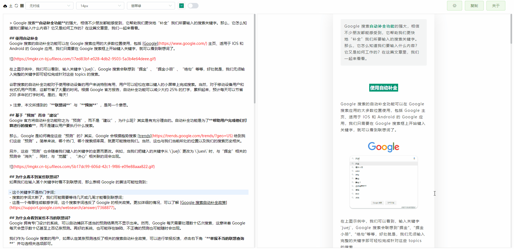
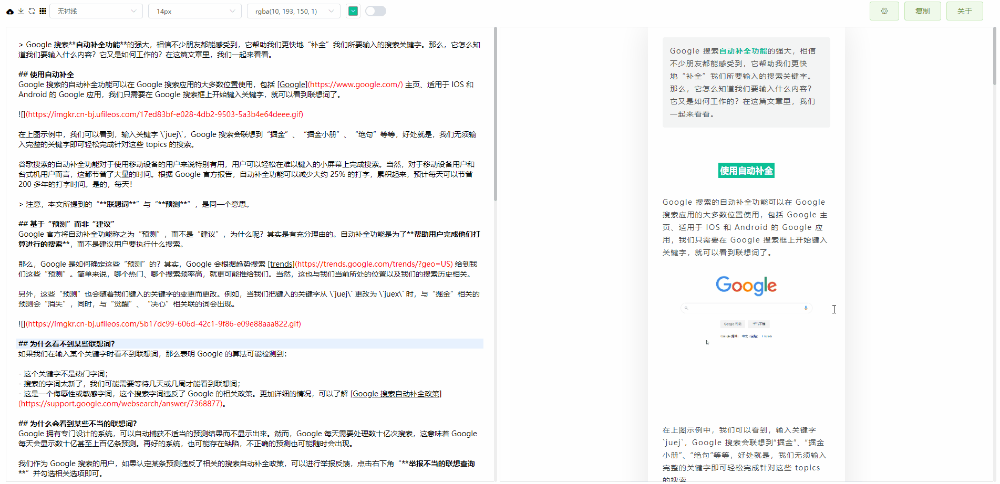
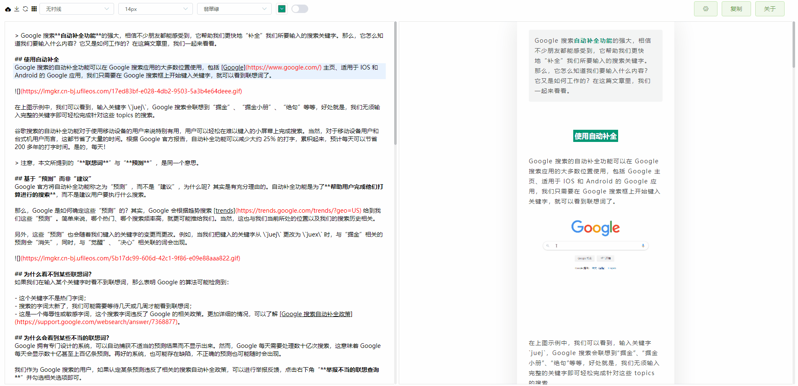
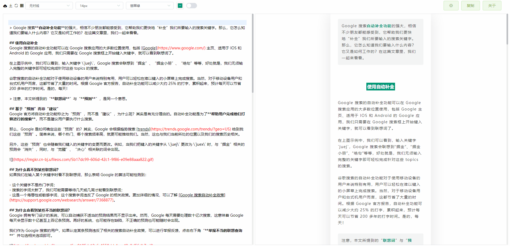

<h1 align="center">微信 Markdown 编辑器</h1>

         

## 项目介绍

> 本项目基于 [wechat-format](https://github.com/lyricat/wechat-format) 进行二次开发，感谢 [lyricat](https://github.com/lyricat) 的创意和贡献！

Markdown 文档自动即时渲染为微信图文，让你不再为微信文章排版而发愁！只要你会基本的 Markdown 语法，就能做出一篇样式简洁而又美观大方的微信图文。

## 在线编辑器地址

- Netlify: https://mdhere.netlify.app
- Gitee Pages：https://doocs.gitee.io/md
- GitHub Pages：https://doocs.github.io/md

注：推荐使用 Chrome 浏览器，效果最佳。另外，对于国内（中国）的朋友，访问 [Gitee Pages](https://doocs.gitee.io/md) 速度会相对快一些。

## 为何二次开发

现有的开源微信 Markdown 编辑器，样式繁杂，也不符合我个人的审美需求。在我使用它们进行文章排版的时候，经常还要自己做一些改动，费时费力，因此动手做了二次开发。

欢迎各位朋友随时提交 PR，让这款微信 Markdown 编辑器变得更好！如果你有新的想法，也欢迎在 Issues 区反馈。

## 功能特性

- [x] 支持自定义 CSS 样式
- [x] 支持 Markdown 所有基础语法
- [x] 支持浅色、暗黑两种主题模式
- [x] 支持 <kbd>Ctrl</kbd> + <kbd>F</kbd> 快速格式化文档
- [x] 支持色盘取色，快速替换文章整体色调
- [x] 支持多图上传，可自定义配置图床
- [x] 支持在编辑框右键弹出功能选项卡

## 目前支持哪些图床

| #   | 图床        | 使用时是否需要配置                                                 | 备注                                                                                                                   |
| --- | ----------- | ------------------------------------------------------------------ | ---------------------------------------------------------------------------------------------------------------------- |
| 1   | 默认图床    | 否                                                                 | -                                                                                                                      |
| 2   | GitHub 图床 | 配置 `Repo`、`Token` 参数                                          | [如何获取 GitHub token？](https://docs.github.com/en/github/authenticating-to-github/creating-a-personal-access-token) |
| 3   | Gitee 图床  | 配置 `Repo`、`Token` 参数                                          | 不支持上传超过 1MB 的图片                                                                                              |
| 4   | 阿里云 OSS  | 配置 `AccessKey ID`、`AccessKey Secret`、`Bucket`、`Region` 等参数 | [如何使用阿里云 OSS？](https://help.aliyun.com/document_detail/31883.html)                                             |
| 5   | 腾讯云 COS  | 配置 `SecretId`、`SecretKey`、`Bucket`、`Region` 等参数            | [如何使用腾讯云 COS？](https://cloud.tencent.com/document/product/436/38484)                                           |
| 6   | 七牛云 Kodo | 配置 `AccessKey`、`SecretKey`、`Bucket`、`Domain`、`Region` 等参数 | [如何使用七牛云 Kodo？](https://developer.qiniu.com/kodo)                                                              |

## 谁在使用

<table>
  <tr>
    <td align="center" style="width: 60px;">
      <a href="https://mp.weixin.qq.com/s/RNKDCK2KoyeuMeEs6GUrow">
         
        Doocs开源社区
      </a>
    </td>
    <td align="center" style="width: 60px;">
      <a href="https://mp.weixin.qq.com/s/FpGIX9viQR6Z9iSCEPH86g">
         
        掘墓人的小铲子
      </a>
    </td>
    <td align="center" style="width: 60px;">
      <a href="https://mp.weixin.qq.com/s/yB3ZH3jmcF_LbzuKmnR9BQ">
         
        全网重点
      </a>
    </td>
    <td align="center" style="width: 60px;">
      <a href="https://mp.weixin.qq.com/s/oc5Z2t9ykbu_Dezjnw5mfQ">
         
        爱码士的内心独白
      </a>
    </td>
    <td align="center" style="width: 60px;">
      <a href="https://mp.weixin.qq.com/s/SFde8OsZ8FzNGMHwpmDtrg">
         
        乐玩nodejs npm工具库
      </a>
    </td>
    <td align="center" style="width: 60px;">
      <a href="https://mp.weixin.qq.com/s/7UG24ZugfI5ZnhUpo8vfvQ">
         
        简静慢
      </a>
    </td>
    <td align="center" style="width: 60px;">
      <a href="https://mp.weixin.qq.com/s/qefHCmToAdowBz2JwBn_ug">
         
        0加1
      </a>
    </td>
    <td align="center" style="width: 60px;">
      <a href="https://mp.weixin.qq.com/s/7bfpKACg7HP-PhBrkpM9IQ">
         
        编程图解
      </a>
    </td>
  </tr>
  <tr>
    <td align="center" style="width: 60px;">
      <a href="https://mp.weixin.qq.com/s/bnlWqzCarDlR4F27HHXNUg">
         
        码云Gitee
      </a>
    </td>
    <td align="center" style="width: 60px;">
      <a href="https://mp.weixin.qq.com/s/CVqmcu_OGG8TQO4FViAQ3w">
         
        好酸一柠檬
      </a>
    </td>
    <td align="center" style="width: 60px;">
      <a href="https://mp.weixin.qq.com/s/leDCdpvnfk8eZRPRRHwg5w">
         
        不知所云Hub
      </a>
    </td>
    <td align="center" style="width: 60px;">
      <a href="https://mp.weixin.qq.com/s/c9ZXxQHCrKz1FP1Zbh1S1w">
         
        会泽百家
      </a>
    </td>
    <td align="center" style="width: 60px;">
      <a href="https://mp.weixin.qq.com/s/MV8ch6qlSsamSaBOhWr9kg">
         
        平凡而诗意
      </a>
    </td>
    <td align="center" style="width: 60px;">
      <a href="https://mp.weixin.qq.com/s/bWPKO-S3TNLsCgzwspHCTg">
         
        治恒说说
      </a>
    </td>
    <td align="center" style="width: 60px;">
      <a href="https://mp.weixin.qq.com/s/AHHrxu7aIYBpvn3PpVHE_Q">
         
        柯宁申的叙事屋
      </a>
    </td>
  </tr>
</table>

注：如果你使用了本 Markdown 编辑器进行文章排版，并且希望在本项目 README 中展示你的公众号，请到 [#5](https://github.com/doocs/md/issues/5) 留言。

## 项目许可证

[本项目没有任何限制，Just Do What The F\*ck You Want。](LICENSE)

---

## Doocs 社区优质项目

Doocs 技术社区，致力于打造一个内容完整、持续成长的互联网开发者学习生态圈！以下是 Doocs 旗下的一些优秀项目，欢迎各位开发者朋友持续保持关注。

| #   | 项目                                                              | 描述                                                                                             | 热度                                                                                                                            |
| --- | ----------------------------------------------------------------- | ------------------------------------------------------------------------------------------------ | ------------------------------------------------------------------------------------------------------------------------------- |
| 1   | [advanced-java](https://github.com/doocs/advanced-java)           | 互联网 Java 工程师进阶知识完全扫盲：涵盖高并发、分布式、高可用、微服务、海量数据处理等领域知识。 |              |
| 2   | [leetcode](https://github.com/doocs/leetcode)                     | 多种编程语言实现 LeetCode、《剑指 Offer（第 2 版）》、《程序员面试金典（第 6 版）》题解。        |                        |
| 3   | [source-code-hunter](https://github.com/doocs/source-code-hunter) | 互联网常用组件框架源码分析。                                                                     |    |
| 4   | [jvm](https://github.com/doocs/jvm)                               | Java 虚拟机底层原理知识总结。                                                                    |                                  |
| 5   | [coding-interview](https://github.com/doocs/coding-interview)     | 代码面试题集，包括《剑指 Offer》、《编程之美》等。                                               |        |
| 6   | [md](https://github.com/doocs/md)                                 | 一款高度简洁的微信 Markdown 编辑器。                                                             |                                    |
| 7   | [technical-books](https://github.com/doocs/technical-books)       | 值得一看的技术书籍列表。                                                                         |          |

## 贡献者

感谢以下所有朋友对 [Doocs 技术社区](https://github.com/doocs) 所做出的贡献，[参与项目维护请戳这儿](https://doocs.github.io/#/?id=how-to-join)。

<!-- ALL-CONTRIBUTORS-LIST: START - Do not remove or modify this section -->

<!-- ALL-CONTRIBUTORS-LIST: END -->
