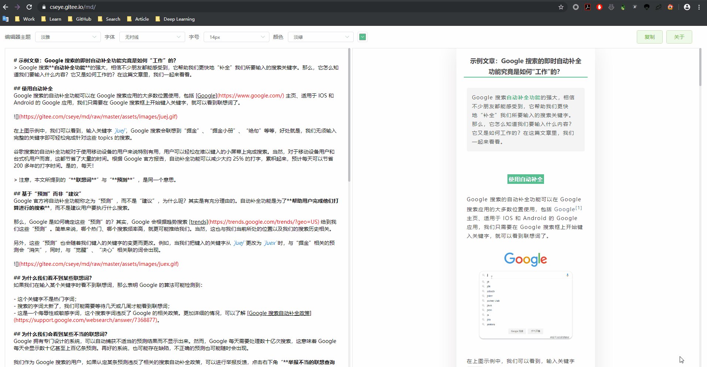
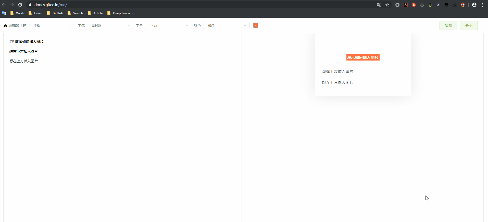

# 微信 Markdown 编辑器
    

> Markdown 文档自动即时渲染为微信图文，让你不再为微信文章排版而发愁！

本项目基于 [wechat-format](https://github.com/lyricat/wechat-format) 进行二次开发，感谢 [lyricat](https://github.com/lyricat) 的创意和贡献！

## 编辑器地址
欢迎使用本微信 Markdown 编辑器进行排版。只要你会基本的 Markdown 语法，就能做出一篇排版美观、大方的微信图文。

- GitHub Page：https://doocs.github.io/md
- Gitee Page：https://doocs.gitee.io/md

注：对于国内（中国）的朋友，访问 Gitee Page 速度会相对快一些。

## 为何二次开发
现有的开源微信 Markdown 编辑器，样式繁杂，也不符合我个人的审美需求。在我使用它们进行文章排版的时候，经常还要自己做一些改动，费时费力，因此动手做了二次开发。

欢迎随时提交 PR，让这款微信 Markdown 编辑器变得更好！

## 功能特性
- [x] 支持 Markdown 所有基础语法
- [x] 支持单独进行字体、字号设置
- [x] 支持色盘取色，并一键替换颜色
- [x] 支持链接微信图文，外链自动转为文末索引
- [x] 支持一键复制并粘贴到公众号后台
- [x] 支持图片上传并将 URL 插入编辑器光标定位处
- [ ] 实现自定义 CSS 并实时渲染（[开发中](https://github.com/doocs/md/tree/feat/custom-css)）

## 示例文章
- [ES6 特性快速扫盲](https://mp.weixin.qq.com/s/I3EzOO0skf8xDCGtyYM5Lg)
- [10 道 BAT 大厂海量数据面试题（附题解+方法总结）](https://mp.weixin.qq.com/s/rjGqxUvrEqJNlo09GrT1Dw)
- [阿里又一个 20k+ stars 开源项目诞生，恭喜 fastjson！](https://mp.weixin.qq.com/s/RNKDCK2KoyeuMeEs6GUrow)

注：如果你使用了本 Markdown 编辑器进行文章排版，并且希望将你的文章加入示例列表，欢迎随时提交 PR。

## 我的公众号
GitHub 技术社区 Doocs 旗下唯一公众号“Doocs 开源社区”，欢迎关注，专注于分享有价值的文章；当然，也可以加我个人微信（备注：GitHub）。

<table>
    <tr>
      <td align="center" style="width: 200px;">
        <a href="https://github.com/doocs">
           
          公众平台
        </a> 
      </td>
      <td align="center" style="width: 200px;">
        <a href="https://github.com/yanglbme">
           
          个人微信
        </a> 
      </td>
    </tr>
</table>
