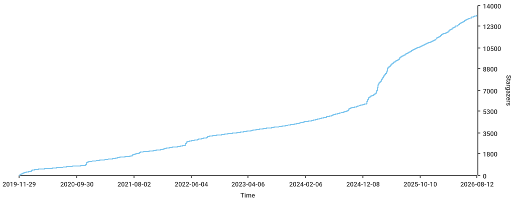

<div align="center">

[](https://github.com/doocs/md)

</div>

<h1 align="center">微信 Markdown 编辑器</h1>

<div align="center">

[](https://github.com/doocs/md/actions) [](https://nodejs.org/en/about/previous-releases) [](https://github.com/doocs/md/pulls) [](https://github.com/doocs/md/stargazers) [](https://github.com/doocs/md)<br> [](https://github.com/doocs/md/releases) [](https://www.npmjs.com/package/@doocs/md-cli) [](https://hub.docker.com/r/doocs/md)

</div>

中文 | [English](./README-EN.md)

## 项目介绍

**Markdown 文档自动即时渲染为微信图文**，让你不再为公众号排版发愁。只需掌握基本的 Markdown 语法，即可生成样式简洁、美观大方的微信图文。

如果这个项目对你有帮助，欢迎点个 Star ⭐️，我们会持续维护与迭代。

## 在线编辑器

[https://md.doocs.org](https://md.doocs.org)

> 推荐使用 Chrome 浏览器以获得最佳体验。

## 为何开发这款编辑器

现有的开源微信 Markdown 编辑器普遍存在样式繁杂、排版需反复调整的问题。本项目致力于提供一个更简洁、易用的编辑器，让内容创作者专注于写作本身，而非排版细节。

欢迎随时提交 PR 参与共建，也欢迎在 [Discussions](https://github.com/doocs/md/discussions) 中分享你的想法。

## 功能特性

- 支持标准 Markdown 语法及数学公式（KaTeX）
- 支持 Mermaid 图表、PlantUML、[GFM 警告块](https://github.com/orgs/community/discussions/16925)
- 支持 Ruby 注音扩展，格式兼容 `[文字]{注音}` 与 `[文字]^(注音)`
- 代码块提供多种高亮主题，可自定义主题色与 CSS 样式
- 内置本地草稿管理，支持内容自动保存
- 登录账户后可同步编辑器偏好（[云同步说明](/docs/cloud-sync.md)）
- 支持多种图床（GitHub、阿里云、腾讯云、七牛云、MinIO、S3、Cloudflare R2 等）
- 支持文件导入与导出
- 集成主流 AI 模型（DeepSeek、OpenAI、通义千问、腾讯混元、火山方舟、302.AI 等），辅助内容创作

## 支持的图床服务

| #   | 图床                                                   | 使用时是否需要配置                                                         | 备注                                                                                                                   |
| --- | ------------------------------------------------------ | -------------------------------------------------------------------------- | ---------------------------------------------------------------------------------------------------------------------- |
| 1   | 默认                                                   | 否                                                                         | -                                                                                                                      |
| 2   | [GitHub](https://github.com)                           | 配置 `Repo`、`Token` 参数                                                  | [如何获取 GitHub token？](https://docs.github.com/en/github/authenticating-to-github/creating-a-personal-access-token) |
| 3   | [阿里云](https://www.aliyun.com/product/oss)           | 配置 `AccessKey ID`、`AccessKey Secret`、`Bucket`、`Region` 参数           | [如何使用阿里云 OSS？](https://help.aliyun.com/document_detail/31883.html)                                             |
| 4   | [腾讯云](https://cloud.tencent.com/act/pro/cos)        | 配置 `SecretId`、`SecretKey`、`Bucket`、`Region` 参数                      | [如何使用腾讯云 COS？](https://cloud.tencent.com/document/product/436/38484)                                           |
| 5   | [七牛云](https://www.qiniu.com/products/kodo)          | 配置 `AccessKey`、`SecretKey`、`Bucket`、`Domain`、`Region` 参数           | [如何使用七牛云 Kodo？](https://developer.qiniu.com/kodo)                                                              |
| 6   | [MinIO](https://min.io/)                               | 配置 `Endpoint`、`Port`、`UseSSL`、`Bucket`、`AccessKey`、`SecretKey` 参数 | [如何使用 MinIO？](http://docs.minio.org.cn/docs/master/)                                                              |
| 7   | [S3 协议](https://aws.amazon.com/s3/)                  | 配置 `Endpoint`、`Region`、`Bucket`、`AccessKey`、`SecretKey` 参数         | 支持 AWS S3、Oracle、DigitalOcean 等兼容 S3 的存储服务                                                                 |
| 8   | [公众号](https://mp.weixin.qq.com/)                    | 配置 `appID`、`appsecret`、`代理域名` 参数                                 | [如何使用公众号图床？](https://md-pages.doocs.org/tutorial)                                                            |
| 9   | [Cloudflare R2](https://developers.cloudflare.com/r2/) | 配置 `AccountId`、`AccessKey`、`SecretKey`、`Bucket`、`Domain` 参数        | [如何使用 S3 API 操作 R2？](https://developers.cloudflare.com/r2/api/s3/api/)                                          |
| 10  | [又拍云](https://www.upyun.com/)                       | 配置 `Bucket`、`Operator`、`Password`、`Domain` 参数                       | [如何使用 又拍云？](https://help.upyun.com/)                                                                           |
| 11  | [Telegram](https://core.telegram.org/api)              | 配置 `Bot Token`、`Chat ID` 参数                                           | [如何使用 Telegram 图床？](https://github.com/doocs/md/blob/main/docs/telegram-usage.md)                               |
| 12  | [Cloudinary](https://cloudinary.com/)                  | 配置 `Cloud Name`、`API Key`、`API Secret` 参数                            | [如何使用 Cloudinary？](https://cloudinary.com/documentation/upload_images)                                            |
| 13  | 自定义上传                                             | 是                                                                         | [如何自定义上传？](/docs/custom-upload.md)                                                                             |

## 产品演示

<div align="center">

|                                       主题切换                                        |                                       图片上传                                        |
| :-----------------------------------------------------------------------------------: | :-----------------------------------------------------------------------------------: |
|  |  |

|                                       样式扩展                                        |                                       一键排版                                        |
| :-----------------------------------------------------------------------------------: | :-----------------------------------------------------------------------------------: |
|  |  |

</div>

## 开发与部署

```sh
# 安装 Node 版本
nvm i && nvm use

# 安装依赖
pnpm i

# 启动开发模式，访问 http://localhost:5173/md/
pnpm web dev

# 构建，部署在 /md 路径下
pnpm web build

# 构建，部署在根路径下
pnpm web build:h5-netlify

# Chrome 扩展开发模式
# 启动后在 chrome://extensions/ 开启开发者模式，加载 apps/web/.output/chrome-mv3-dev 目录
pnpm web ext:dev

# 打包 Chrome 扩展
pnpm web ext:zip

# 打包 Firefox 扩展，输出至 apps/web/.output/md-{version}-firefox.zip
pnpm web firefox:zip

# 打包 uTools 插件，输出至 apps/utools/release/md-utools-v{version}.zip
pnpm utools:package

# Cloudflare Workers 开发与部署
pnpm web wrangler:dev
pnpm web wrangler:deploy
```

## 私有化部署

### 方式一：npm cli

```sh
# 全局安装
npm i -g @doocs/md-cli

# 启动（默认端口 8800）
md-cli

# 指定端口启动
md-cli port=8899
```

支持的命令行参数：

- `port`：监听端口，默认 `8800`，端口被占用时自动随机选取
- `spaceId`：dcloud 服务空间配置
- `clientSecret`：dcloud 服务空间配置

### 方式二：Docker

```sh
docker run -d -p 8080:80 doocs/md:latest
```

启动后访问 http://localhost:8080 即可。Docker 镜像的更多信息，请参考 https://github.com/doocs/docker-md

## Star 趋势

<a href="https://github.com/doocs/md/stargazers" target="_blank"></a>

## 谁在使用

请查看 [USERS.md](USERS.md)，了解使用本项目的公众号列表。

## 参与贡献

欢迎提交 PR 或 Issue，请参阅 [CONTRIBUTING.md](./CONTRIBUTING.md) 了解贡献流程与规范。

## 支持我们

如果本项目对你有所帮助，欢迎通过以下方式支持我们持续维护。

<table style="margin: 0 auto">
  <tbody>
    <tr>
      <td align="center" style="width: 260px">
        <br />
      </td>
      <td align="center" style="width: 260px">
        <br />
      </td>
    </tr>
  </tbody>
</table>

## 反馈与交流

使用中遇到问题或有功能建议，欢迎在 [Issues](https://github.com/doocs/md/issues) 中反馈。也可扫码加入微信交流群，若二维码失效，请添加好友并备注 `md`。

<table style="margin: 0 auto">
  <tbody>
    <tr>
      <td align="center" style="width: 260px">
        <br />
      </td>
      <td align="center" style="width: 260px">
        <br />
      </td>
    </tr>
  </tbody>
</table>


## 🌐 Web Resources & Aesthetic Symbols Index
- [SYM 2672](https://lace-bow-symbols-18.pages.dev/symbol/sym-2672/)
- [SYM 1F975](https://pastel-chibi-emotes-23.pages.dev/symbol/sym-1f975/)
- [SYM 1F62D](https://zen-unicode-hub-94.pages.dev/symbol/sym-1f62d/)
- [FREEFIRE NAMES](https://clean-aesthetic-fonts-73.pages.dev/vi/freefire-names/)
- [KAOMOJI](https://gothic-bio-fonts-14.pages.dev/kaomoji/)
- [SYM 1D436](https://zen-unicode-hub-94.pages.dev/symbol/sym-1d436/)
- [SYM 1D497](https://minimal-star-symbols-87.pages.dev/symbol/sym-1d497/)
- [SYM 1F47B](https://gothic-bio-fonts-81.pages.dev/symbol/sym-1f47b/)
- [DISCORD STATUS](https://scholarly-cross-symbols-35.pages.dev/pt/discord-status/)
- [BLACK HEART](https://kawaii-kaomoji-hub-80.pages.dev/symbol/black-heart/)
- [ROBLOX NAMES](https://minimal-star-symbols-87.pages.dev/es/roblox-names/)
- [SYM 1F910](https://minimal-star-symbols-87.pages.dev/symbol/sym-1f910/)
- [SYM 2689](https://raven-gothic-kaomoji-25.pages.dev/symbol/sym-2689/)
- [SYM 26AB](https://raven-gothic-kaomoji-25.pages.dev/symbol/sym-26ab/)
- [SYM 2745](https://kawaii-kaomoji-hub-96.pages.dev/symbol/sym-2745/)
- [PT](https://chibi-emoticon-lab-65.pages.dev/pt/)
- [SYM 26EC](https://anime-sparkle-text-73.pages.dev/symbol/sym-26ec/)
- [SYM 1D445](https://minimal-star-symbols-25.pages.dev/symbol/sym-1d445/)
- [SYM 26AA](https://raven-gothic-kaomoji-25.pages.dev/symbol/sym-26aa/)
- [SYM 2681](https://chibi-emoticon-lab-65.pages.dev/symbol/sym-2681/)
- [SPRING TULIP BLOSSOM](https://minimal-star-symbols-25.pages.dev/symbol/spring-tulip-blossom/)
- [SYM 26F5](https://anime-sparkle-text-73.pages.dev/symbol/sym-26f5/)
- [ARROWS LINES](https://anime-sparkle-text-22.pages.dev/ru/arrows-lines/)
- [SYM 2643](https://anime-sparkle-text-22.pages.dev/symbol/sym-2643/)
- [SYM 26B4](https://raven-gothic-kaomoji-25.pages.dev/symbol/sym-26b4/)
- [SYM 1F61C](https://minimal-star-symbols-25.pages.dev/symbol/sym-1f61c/)
- [SYM 1D454](https://kawaii-kaomoji-hub-96.pages.dev/symbol/sym-1d454/)
- [FREEFIRE NAMES](https://kawaii-kaomoji-hub-80.pages.dev/pt/freefire-names/)
- [SYM 1D45C](https://anime-sparkle-text-22.pages.dev/symbol/sym-1d45c/)
- [SYM 1D408](https://clean-aesthetic-fonts-33.pages.dev/symbol/sym-1d408/)
- [SYM 26EA](https://minimal-star-symbols-87.pages.dev/symbol/sym-26ea/)
- [SYM 1F92E](https://kawaii-kaomoji-hub-96.pages.dev/symbol/sym-1f92e/)
- [SYM 26F5](https://zen-unicode-hub-94.pages.dev/symbol/sym-26f5/)
- [SYM 1F61D](https://zen-unicode-hub-94.pages.dev/symbol/sym-1f61d/)
- [SYM 1D428](https://anime-sparkle-text-22.pages.dev/symbol/sym-1d428/)
- [SYM 26BC](https://anime-sparkle-text-73.pages.dev/symbol/sym-26bc/)
- [SYM 1D489](https://minimal-star-symbols-87.pages.dev/symbol/sym-1d489/)
- [SYM 26EB](https://anime-sparkle-text-73.pages.dev/symbol/sym-26eb/)
- [SYM 1D433](https://minimal-star-symbols-87.pages.dev/symbol/sym-1d433/)
- [SYM 273D](https://raven-gothic-kaomoji-25.pages.dev/symbol/sym-273d/)
- [SYM 1D49F](https://minimal-star-symbols-87.pages.dev/symbol/sym-1d49f/)
- [SYM 263F](https://raven-gothic-kaomoji-25.pages.dev/symbol/sym-263f/)
- [SYM 1F47F](https://chibi-emoticon-lab-65.pages.dev/symbol/sym-1f47f/)
- [SYM 267D](https://raven-gothic-kaomoji-25.pages.dev/symbol/sym-267d/)
- [SYM 2645](https://chibi-emoticon-lab-65.pages.dev/symbol/sym-2645/)
- [SINGLE EIGHTH MUSICAL NOTE](https://minimal-star-symbols-25.pages.dev/symbol/single-eighth-musical-note/)
- [SYM 26B6](https://raven-gothic-kaomoji-25.pages.dev/symbol/sym-26b6/)
- [SYM 26DF](https://anime-sparkle-text-73.pages.dev/symbol/sym-26df/)
- [SYM 2642](https://raven-gothic-kaomoji-25.pages.dev/symbol/sym-2642/)
- [SYM 2678](https://raven-gothic-kaomoji-25.pages.dev/symbol/sym-2678/)
- [SYM 1D431](https://clean-aesthetic-fonts-33.pages.dev/symbol/sym-1d431/)
- [SYM 1D494](https://minimal-star-symbols-87.pages.dev/symbol/sym-1d494/)
- [SYM 1F612](https://zen-unicode-hub-94.pages.dev/symbol/sym-1f612/)
- [SYM 26C2](https://anime-sparkle-text-73.pages.dev/symbol/sym-26c2/)
- [SYM 1D40D](https://anime-sparkle-text-22.pages.dev/symbol/sym-1d40d/)
- [SYM 2643](https://chibi-emoticon-lab-65.pages.dev/symbol/sym-2643/)
- [SYM 1D481](https://clean-aesthetic-fonts-33.pages.dev/symbol/sym-1d481/)
- [MINIMAL STAR SYMBOLS 25.PAGES.DEV](https://minimal-star-symbols-25.pages.dev/)
- [SYM 1F912](https://minimal-star-symbols-25.pages.dev/symbol/sym-1f912/)
- [MUSIC WEATHER](https://kawaii-kaomoji-hub-80.pages.dev/es/music-weather/)
- [SYM 1D44B](https://zen-unicode-hub-94.pages.dev/symbol/sym-1d44b/)
- [SCORPIO ZODIAC SCORPION](https://chibi-emoticon-lab-65.pages.dev/symbol/scorpio-zodiac-scorpion/)
- [SYM 26C7](https://sleek-bio-symbols-40.pages.dev/symbol/sym-26c7/)
- [SYM 1F601](https://minimal-star-symbols-25.pages.dev/symbol/sym-1f601/)
- [SYM 2741](https://kawaii-kaomoji-hub-96.pages.dev/symbol/sym-2741/)
- [SYM 2625](https://raven-gothic-kaomoji-25.pages.dev/symbol/sym-2625/)
- [SYM 1D434](https://clean-aesthetic-fonts-33.pages.dev/symbol/sym-1d434/)
- [SYM 1F62A](https://zen-unicode-hub-94.pages.dev/symbol/sym-1f62a/)
- [SYM 1D48E](https://anime-sparkle-text-22.pages.dev/symbol/sym-1d48e/)
- [SYM 1F636](https://minimal-star-symbols-25.pages.dev/symbol/sym-1f636/)
- [SYM 26DB](https://anime-sparkle-text-22.pages.dev/symbol/sym-26db/)
- [SYM 1F614](https://raven-gothic-kaomoji-25.pages.dev/symbol/sym-1f614/)
- [SYM 2738](https://raven-gothic-kaomoji-25.pages.dev/symbol/sym-2738/)
- [SYM 1F928](https://clean-aesthetic-fonts-33.pages.dev/symbol/sym-1f928/)
- [SYM 26D9](https://anime-sparkle-text-73.pages.dev/symbol/sym-26d9/)
- [SYM 1D414](https://clean-aesthetic-fonts-33.pages.dev/symbol/sym-1d414/)
- [SYM 1F49D](https://clean-aesthetic-fonts-33.pages.dev/symbol/sym-1f49d/)
- [SYM 1D45E](https://anime-sparkle-text-73.pages.dev/symbol/sym-1d45e/)
- [ROTATED HEART BULLET](https://minimal-star-symbols-25.pages.dev/symbol/rotated-heart-bullet/)
- [ZODIAC CELESTIAL](https://minimal-star-symbols-87.pages.dev/ja/zodiac-celestial/)
- [SYM 1F479](https://minimal-star-symbols-25.pages.dev/symbol/sym-1f479/)
- [KAOMOJI](https://pastel-manga-symbols-57.pages.dev/vi/kaomoji/)
- [SYM 1D437](https://chibi-emoticon-lab-65.pages.dev/symbol/sym-1d437/)
- [SYM 1D462](https://anime-sparkle-text-22.pages.dev/symbol/sym-1d462/)
- [SYM 1F497](https://raven-gothic-kaomoji-25.pages.dev/symbol/sym-1f497/)
- [SYM 2744](https://raven-gothic-kaomoji-25.pages.dev/symbol/sym-2744/)
- [STARS](https://kawaii-kaomoji-hub-80.pages.dev/ru/stars/)
- [SYM 26BB](https://anime-sparkle-text-73.pages.dev/symbol/sym-26bb/)
- [SYM 26B5](https://raven-gothic-kaomoji-25.pages.dev/symbol/sym-26b5/)
- [SYM 1F925](https://clean-aesthetic-fonts-33.pages.dev/symbol/sym-1f925/)
- [SYM 26C4](https://anime-sparkle-text-73.pages.dev/symbol/sym-26c4/)
- [FREE FIRE CLAN EMPEROR CROWN](https://glitch-font-studio-46.pages.dev/symbol/free-fire-clan-emperor-crown/)
- [SYM 1D441](https://anime-sparkle-text-23.pages.dev/symbol/sym-1d441/)
- [SYM 1F649](https://kawaii-kaomoji-hub-96.pages.dev/symbol/sym-1f649/)
- [SYM 2734](https://monochrome-text-lab-86.pages.dev/symbol/sym-2734/)
- [SYM 1F913](https://monochrome-text-lab-86.pages.dev/symbol/sym-1f913/)
- [SYM 1D424](https://chibi-emoticon-lab-65.pages.dev/symbol/sym-1d424/)
- [ES](https://minimal-star-symbols-25.pages.dev/es/)
- [SYM 1D405](https://anime-sparkle-text-73.pages.dev/symbol/sym-1d405/)
- [MUSIC FLAT SIGN](https://minimal-star-symbols-25.pages.dev/symbol/music-flat-sign/)
- [SYM 1F615](https://kawaii-kaomoji-hub-93.pages.dev/symbol/sym-1f615/)
- [BORDERS DIVIDERS](https://pearl-girly-fonts-86.pages.dev/pt/borders-dividers/)
- [SYM 1F635 200D 1F4AB](https://coquette-aesthetic-symbols-86.pages.dev/symbol/sym-1f635-200d-1f4ab/)
- [SYM 2674](https://kawaii-kaomoji-hub-80.pages.dev/symbol/sym-2674/)
- [SYM 1F638](https://monochrome-text-lab-86.pages.dev/symbol/sym-1f638/)
- [SYM 2680](https://raven-gothic-kaomoji-25.pages.dev/symbol/sym-2680/)
- [SYM 1D47F](https://lace-heart-kaomoji-64.pages.dev/symbol/sym-1d47f/)
- [SYM 1D455](https://gothic-bio-fonts-13.pages.dev/symbol/sym-1d455/)
- [SYM 26B8](https://pastel-manga-symbols-57.pages.dev/symbol/sym-26b8/)
- [SYM 1F636 200D 1F32B FE0F](https://mecha-blade-symbols-46.pages.dev/symbol/sym-1f636-200d-1f32b-fe0f/)
- [SYM 26D3](https://cyberpunk-clan-tags-43.pages.dev/symbol/sym-26d3/)
- [SYM 2637](https://kawaii-kaomoji-hub-93.pages.dev/symbol/sym-2637/)
- [SYM 1F606](https://witchy-runic-text-71.pages.dev/symbol/sym-1f606/)
- [SYM 26B0](https://neon-glitch-symbols-84.pages.dev/symbol/sym-26b0/)
- [SYM 1F61B](https://minimal-star-symbols-25.pages.dev/symbol/sym-1f61b/)
- [SINGLE EIGHTH MUSICAL NOTE](https://raven-gothic-kaomoji-25.pages.dev/symbol/single-eighth-musical-note/)
- [VIRGO ZODIAC MAIDEN](https://pastel-manga-symbols-57.pages.dev/symbol/virgo-zodiac-maiden/)
- [GAMING WEAPONS](https://pastel-manga-symbols-57.pages.dev/es/gaming-weapons/)
- [SYM 1F618](https://zen-unicode-hub-94.pages.dev/symbol/sym-1f618/)
- [LATIN CROSS FAITH](https://raven-gothic-kaomoji-25.pages.dev/symbol/latin-cross-faith/)
- [SYM 1D466](https://kawaii-kaomoji-hub-93.pages.dev/symbol/sym-1d466/)
- [SYM 26F0](https://clean-aesthetic-fonts-33.pages.dev/symbol/sym-26f0/)
- [SYM 1D491](https://zen-unicode-hub-94.pages.dev/symbol/sym-1d491/)
- [SYM 1F976](https://pastel-manga-symbols-57.pages.dev/symbol/sym-1f976/)
- [SYM 1D495](https://witchy-runic-text-71.pages.dev/symbol/sym-1d495/)
- [ROBLOX NAMES](https://minimal-star-symbols-87.pages.dev/roblox-names/)
- [SYM 1F642](https://coquette-symbols.pages.dev/symbol/sym-1f642/)
- [LEFT WING CLAN FLARE](https://minimal-star-symbols-25.pages.dev/symbol/left-wing-clan-flare/)
- [SYM 1F648](https://chibi-emoticon-lab-65.pages.dev/symbol/sym-1f648/)
- [SYM 1D455](https://matrix-hacker-text-52.pages.dev/symbol/sym-1d455/)
