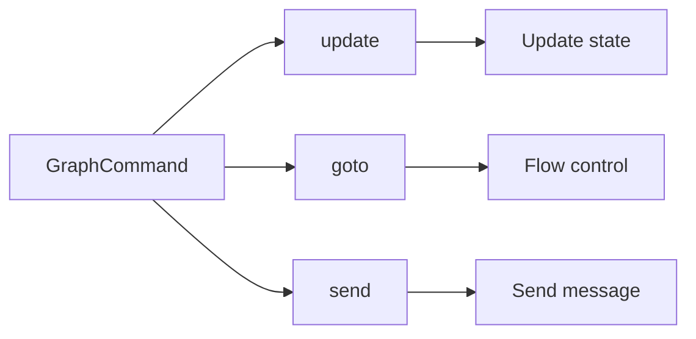
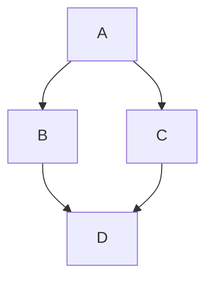
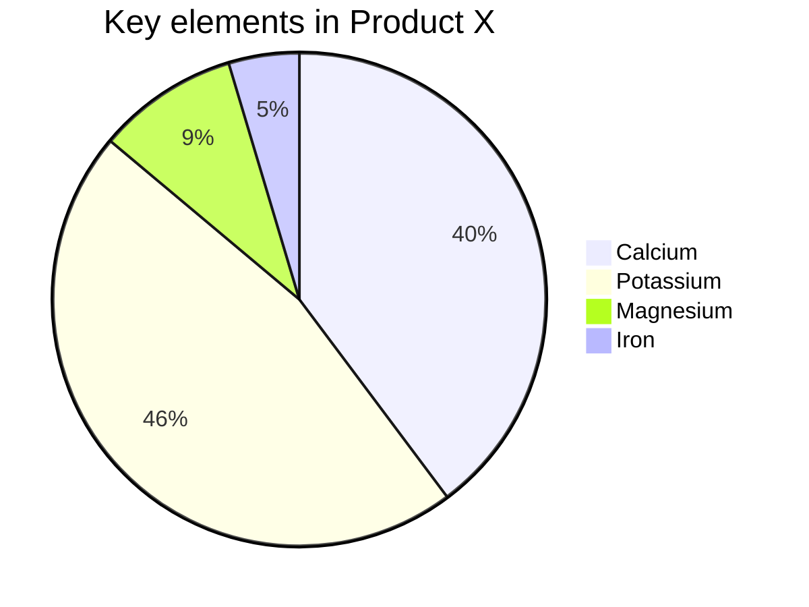
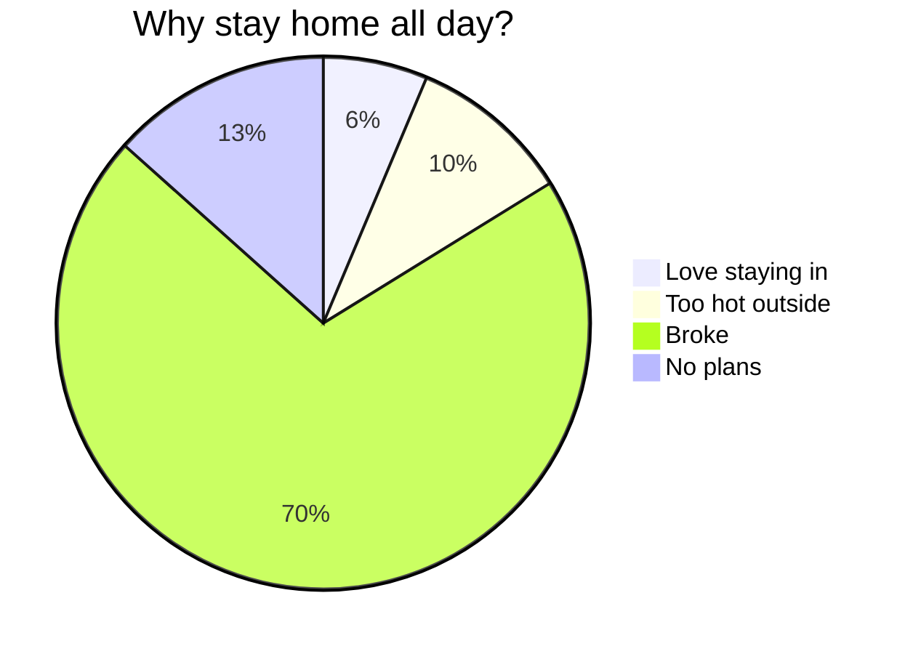
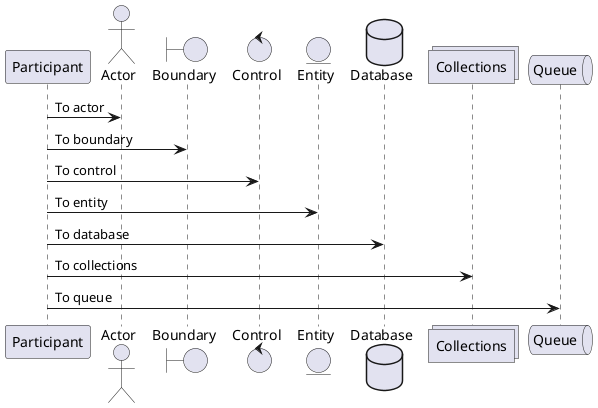

# Explore the Wonderful World of Markdown

Welcome to the wonderful world of Markdown! Whether you are a writer, developer, blogger, or someone who simply wants to jot things down, Markdown can be your new companion. It makes writing simple and clear, and turns plain text into beautiful web pages with ease. Today we will walk through Markdown basics and advanced syntax so you can enjoy writing along the way.

Markdown is a lightweight markup language for formatting plain text. Known for its simple, intuitive syntax, it can generate HTML quickly. Markdown is the perfect blend of writing and code — simple yet powerful.

## Markdown Basics

### 1. Headings: Structure your content

Create headings with `#`. The number of `#` characters indicates the heading level.

```markdown
# Heading 1

## Heading 2

### Heading 3

#### Heading 4
```

The snippet above renders a clear hierarchy that keeps your content organized.

### 2. Paragraphs and line breaks: Natural flow

In Markdown, paragraphs are consecutive lines of text. To start a new paragraph, leave a blank line between two blocks of text.

### 3. Text styles: Emphasize your words

- **Bold**: Wrap text with two asterisks or underscores, e.g. `**bold**` or `__bold__`.
- _Italic_: Wrap text with one asterisk or underscore, e.g. `*italic*` or `_italic_`.
- ~~Strikethrough~~: Wrap text with two tildes, e.g. `~~strikethrough~~`.
- ==Highlight==: Wrap text with two equals signs, e.g. `==highlight==`.
- ++Underline++: Wrap text with two plus signs, e.g. `++underline++`.
- ~Wavy underline~: Wrap text with one tilde, e.g. `~wavy~`.

These simple marks add hierarchy and emphasis to your writing.

### 4. Lists: Clean and ordered

- **Unordered list**: Start a line with `-`, `*`, or `+` followed by a space.
- **Ordered list**: Start a line with a number and a period (`1.`, `2.`).

Need nested content? Indent to nest items.

- Unordered item 1
  1. Nested ordered item 1
  2. Nested ordered item 2
- Unordered item 2

1. Ordered item 1
2. Ordered item 2

### 5. Links and images: Enrich your content

- **Link**: Use brackets and parentheses — `[display text](url)`.
- **Image**: Same as a link, but prefix with `!`, e.g. ``.

[Visit Doocs](https://github.com/doocs)


Rich media, made simple!

> WeChat Official Accounts only allow links to other official-account content. External links may look like links but cannot be opened.

> Write such URLs in plain text, or enable **Format → Convert external WeChat links to footnotes** so readers can see the destinations at the bottom.

You can also create a horizontal image slider with `<,>`, which works on WeChat Official Accounts. Use similarly sized images for the best result.

### 6. Blockquotes: Quotes and thoughtful lines

Create a quote with `>`. For nested quotes, add another `>` on the next level.

> This is a quote
>
> > This is a nested quote

Nested quotes give your citations more depth.

### 7. Code blocks: Show your code

- **Inline code**: Wrap with backticks, e.g. `code`.
- **Code block**: Wrap with three backticks and specify a language, e.g.:

```js
console.log(`Hello, Doocs!`)
```

Syntax highlighting makes code easier to read.

### 8. Horizontal rules: Separate sections

Create a rule with three or more `-`, `*`, or `_` characters.

---

Add visual separation to your content.

### 9. Tables: Present data clearly

Markdown supports simple tables with `|` and `-` to separate cells and headers.

| Contributor                                 | Email                  | WeChat ID    |
| ------------------------------------------- | ---------------------- | ------------ |
| [yanglbme](https://github.com/yanglbme)     | contact@yanglibin.info | YLB0109      |
| [YangFong](https://github.com/YangFong)     | yangfong2022@gmail.com | yq2419731931 |

Tables keep data neat and readable!

> Tired of writing table markup by hand? Use **Edit → Insert table** in the top-left menu for a quick insert.

### 10. Table of contents: Auto-generated navigation

Put `[TOC]` on its own line to generate a hierarchical table of contents from your headings.

```markdown
[TOC]
```

> Level-1 headings (`#`) are excluded. Anchor links are generated from each heading’s position in the document.

## Advanced Markdown

### 1. LaTeX formulas: Math done right

Markdown can embed LaTeX math:

- **Inline**: Wrap with `$`, e.g. $E = mc^2$.
- **Block**: Wrap with `$$`, e.g.:

$$
\begin{aligned}
d_{i, j} &\leftarrow d_{i, j} + 1 \\
d_{i, y + 1} &\leftarrow d_{i, y + 1} - 1 \\
d_{x + 1, j} &\leftarrow d_{x + 1, j} - 1 \\
d_{x + 1, y + 1} &\leftarrow d_{x + 1, y + 1} + 1
\end{aligned}
$$

Standard LaTeX delimiters are also supported:

- **Inline**: `\(...\)`, e.g. \(x^2 + y^2 = z^2\).
- **Block**: `\[...\]`, e.g.:

\[
\int\_{-\infty}^{\infty} e^{-x^2} dx = \sqrt{\pi}
\]

You can mix styles in one paragraph: classic $a + b = c$ and LaTeX \(d + e = f\).

1. Block formula inside a list 1

$$
\chi^2 = \sum \frac{(O - E)^2}{E}
$$

2. Block formula inside a list 2

$$
\chi^2 = \sum \frac{(|O - E| - 0.5)^2}{E}
$$

Perfect for complex math!

> [!TIP]
> Click a LaTeX formula in the preview to open the formula editor, complete with a built-in formula library for quick edits.

### 2. Mermaid diagrams: Visualize flows

Mermaid lets you create flowcharts, sequence diagrams, and more inside Markdown.









Diagrams make processes clear and documents more professional.

> Learn more: [Mermaid User Guide](https://mermaid.js.org/intro/getting-started.html).

### 3. PlantUML diagrams: Visualize flows

PlantUML is another powerful tool for flowcharts, sequence diagrams, and more in Markdown.



> Learn more: [PlantUML homepage](https://plantuml.com/).

### 4. Infographic: Visualize data

A next-generation infographic engine that brings text to life!

```infographic
infographic list-row-horizontal-icon-arrow
data
  title Customer growth engine
  desc Multi-channel reach and repurchase
  items
    - label Lead acquisition
      value 18.6
      desc Ads and content acquisition
      icon rocket-launch
    - label Conversion lift
      value 12.4
      desc Lead scoring and follow-ups
      icon progress-check
    - label Repurchase
      value 9.8
      desc Membership and benefits
      icon account-sync
    - label Word of mouth
      value 6.2
      desc Community incentives and referrals
      icon account-group
```

> Learn more: [AntV Infographic Gallery](https://infographic.antv.vision/gallery).

### 5. Ruby annotations: Phonetic markup

Two formats are supported:

```md
1. [text]{reading}
2. [text]^(reading)
```

Rendered examples:

[你好]{nǐ hǎo} [世界]{shì jiè}

Supported separators: `・` (middle dot), `．` (full-width period), `。` (CJK period), `-` (hyphen)

Examples:

```md
[你好世界]{nǐ・hǎo・shì・jiè}
[小夜時雨]^(さ・よ・しぐれ)
```

[你好世界]{nǐ・hǎo・shì・jiè}
[小夜時雨]^(さ・よ・しぐれ)

When the number of syllables and separators does not match, the closest fit is chosen automatically.

```md
[小夜時雨]{さ・よ・しぐれ}
[小夜時雨]{さ・よ}
[小夜]{さ・よ・しぐれ}
[小夜時雨]{さ・よ・しぐれ・extra}
```

[小夜時雨]{さ・よ・しぐれ}
[小夜時雨]{さ・よ}
[小夜]{さ・よ・しぐれ}
[小夜時雨]{さ・よ・しぐれ・extra}

### 6. Callouts and environments: Highlight key points

Use `> [!type]` or `::: type ... :::` to create styled callouts. You can add a **custom title** after the type; the body supports full Markdown and math.

Common callout types:

> [!NOTE]
> Information readers should notice even when skimming.

> [!TIP]
> Helpful tips that make a task easier.

> [!IMPORTANT] Read before ship
> A custom title after the type overrides the default.

> [!WARNING]
> Critical content that needs immediate attention.

Container syntax works the same way:

::: tip
This tip uses container syntax.
:::

Built-in academic environments (theorem, lemma, definition, and more) also accept formulas in the body:

::: theorem Pythagorean theorem
In a right triangle, the square of the hypotenuse equals the sum of the squares of the other two sides: $a^2 + b^2 = c^2$.
:::

::: definition
If for every $\varepsilon > 0$ there exists $\delta > 0$ such that $0 < |x - a| < \delta$ implies $|f(x) - L| < \varepsilon$, then $\lim_{x \to a} f(x) = L$.
:::

::: proof
Follows directly from the definition above. Q.E.D.
:::

The type name can be **any text**. Unrecognized types use a default style with the name as the title:

::: Corollary
Any name renders as a titled box.
:::

## Closing

Markdown is a simple, powerful, and easy-to-learn markup language. With the basics and advanced features above, you can create content quickly and communicate clearly — whether for technical docs, a personal blog, or project notes. We hope this guide helps you unlock Markdown’s potential and make writing more enjoyable.

Open your Markdown editor and start creating. Explore Markdown — it is more delightful than you might expect!

### Further reading

- [Another Alibaba open-source project hits 20k+ stars — congrats, fastjson!](https://mp.weixin.qq.com/s/RNKDCK2KoyeuMeEs6GUrow)
- [Internet big-tech mass-data interview questions that eliminate 90% of candidates](https://mp.weixin.qq.com/s/rjGqxUvrEqJNlo09GrT1Dw)
- [How text blocks in Java 13 actually help](https://mp.weixin.qq.com/s/kalGv5T8AZGxTnLHr2wDsA)
- [2019 GitHub contribution rankings — Microsoft & Google lead, Alibaba in the top 12](https://mp.weixin.qq.com/s/_q812aGD1b9QvZ2WFI0Qgw)

---

<center>
    
</center>
