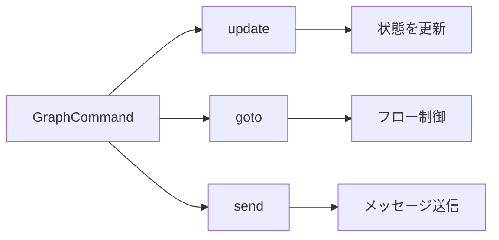
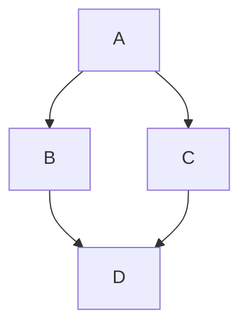
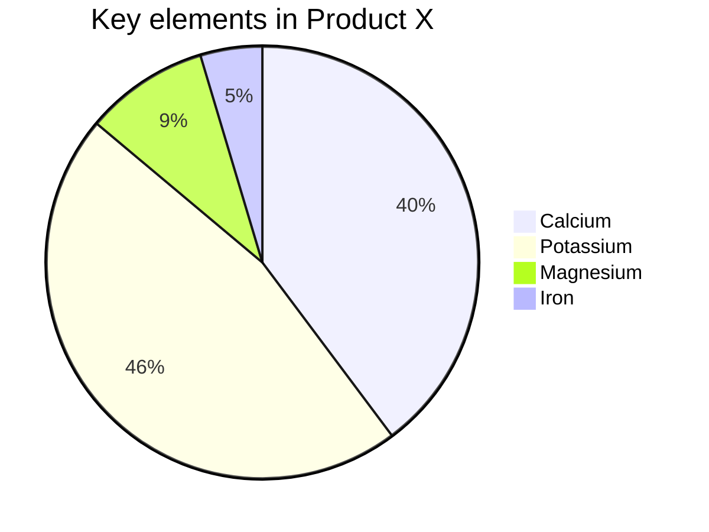
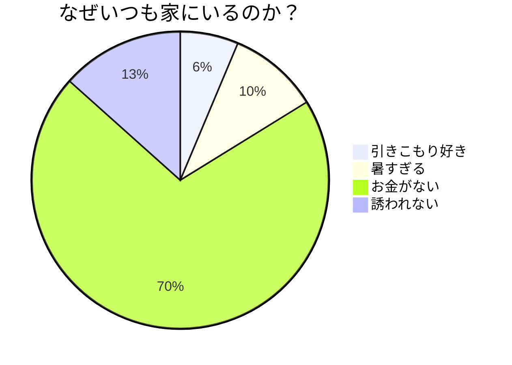
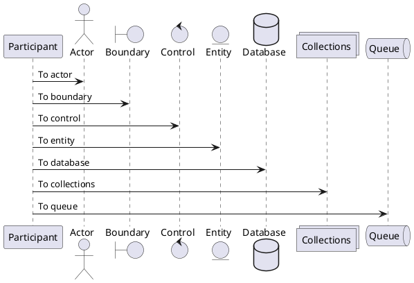

# Markdown の不思議な世界を探検しよう

Markdown の世界へようこそ！ライター、開発者、ブロガー、あるいはちょっとしたメモを残したい人にとって、Markdown は頼れる相棒になります。書くことがシンプルで分かりやすくなり、プレーンテキストを美しいウェブページへ簡単に変換できます。今日は基礎から応用まで Markdown の文法を一通り見て、書く楽しさを味わいましょう。

Markdown はプレーンテキストを整形するための軽量マークアップ言語です。シンプルで直感的な文法が特長で、すばやく HTML を生成できます。文章とコードの良いところをあわせ持った、簡単で強力な記法です。

## Markdown の基礎文法

### 1. 見出し：内容に階層をつける

`#` で見出しを作ります。`#` の個数が見出しレベルです。

```markdown
# 見出し 1

## 見出し 2

### 見出し 3

#### 見出し 4
```

上記のコードは階層のはっきりした見出しを描画し、内容を整理しやすくします。

### 2. 段落と改行：自然な流れ

Markdown の段落は連続したテキスト行です。新しい段落を始めるには、2 つのテキストブロックのあいだに空行を入れます。

### 3. 文字スタイル：言葉を強調する

- **太字**：アスタリスクまたはアンダースコア 2 つで囲む。例：`**太字**` または `__太字__`。
- _斜体_：アスタリスクまたはアンダースコア 1 つで囲む。例：`*斜体*` または `_斜体_`。
- ~~取り消し線~~：チルダ 2 つで囲む。例：`~~取り消し線~~`。
- ==ハイライト==：等号 2 つで囲む。例：`==ハイライト==`。
- ++下線++：プラス 2 つで囲む。例：`++下線++`。
- ~波線~：チルダ 1 つで囲む。例：`~波線~`。

これらの簡単なマークで、文章に階層と重点を付けられます。

### 4. リスト：すっきり整理

- **箇条書き**：行頭に `-`、`*`、または `+` とスペース。
- **番号付きリスト**：行頭に数字とピリオド（`1.`、`2.`）。

入れ子にするにはインデントします。

- 箇条書き 1
  1. 入れ子の番号付き 1
  2. 入れ子の番号付き 2
- 箇条書き 2

1. 番号付き 1
2. 番号付き 2

### 5. リンクと画像：内容を豊かにする

- **リンク**：角括弧と丸括弧で `[表示テキスト](URL)`。
- **画像**：リンクの前に `!` を付ける。例：``。

[Doocs を見る](https://github.com/doocs)


リッチなメディア表現も簡単です！

> 微信公式アカウントでは、他の公式アカウント以外へのリンクはクリックできない場合があります（見た目だけリンクになることがあります）。

> そのような URL は本文にそのまま書くか、左上の「書式 → 微信外リンクを脚注に変換」を有効にして、末尾でリンク先を確認できるようにしてください。

また `<,>` 構文で横スクロールのスライドショーを作れ、微信公式アカウントでも利用できます。似たサイズの画像を使うと表示がきれいになります。

### 6. 引用：名言や考えさせられる一文

`>` で引用を作ります。入れ子の引用は、さらに `>` を重ねます。

> これは引用です
>
> > これは入れ子の引用です

引用にも階層を付けられます。

### 7. コードブロック：コードを見せる

- **インラインコード**：バッククォートで囲む。例：`code`。
- **コードブロック**：バッククォート 3 つで囲み、言語を指定します。例：

```js
console.log(`Hello, Doocs!`)
```

シンタックスハイライトで読みやすくなります。

### 8. 区切り線：内容を分ける

`-`、`*`、または `_` を 3 つ以上並べると区切り線になります。

---

視覚的な区切りを追加できます。

### 9. 表：データをわかりやすく

`|` と `-` でセルと見出しを区切るシンプルな表が使えます。

| 貢献者                                      | メール                 | WeChat ID    |
| ------------------------------------------- | ---------------------- | ------------ |
| [yanglbme](https://github.com/yanglbme)     | contact@yanglibin.info | YLB0109      |
| [YangFong](https://github.com/YangFong)     | yangfong2022@gmail.com | yq2419731931 |

表があるとデータが見やすくなります！

> 手書きのマークアップが面倒なら、左上の「編集 → 表を挿入」からすばやく挿入できます。

### 10. 目次：自動生成ナビ

文書内の独立した 1 行に `[TOC]` と書くと、見出しから階層目次が自動生成されます。

```markdown
[TOC]
```

> レベル 1 の見出し（`#`）は目次に含まれません。アンカーは見出しの位置から自動生成されます。

## Markdown の応用テクニック

### 1. LaTeX 数式：数学表現を美しく

Markdown には LaTeX 数式を埋め込めます。

- **インライン**：`$` で囲む。例：$E = mc^2$。
- **ブロック**：`$$` で囲む。例：

$$
\begin{aligned}
d_{i, j} &\leftarrow d_{i, j} + 1 \\
d_{i, y + 1} &\leftarrow d_{i, y + 1} - 1 \\
d_{x + 1, j} &\leftarrow d_{x + 1, j} - 1 \\
d_{x + 1, y + 1} &\leftarrow d_{x + 1, y + 1} + 1
\end{aligned}
$$

**標準 LaTeX 記法**にも対応しています。

- **インライン**：`\(...\)`。例：\(x^2 + y^2 = z^2\)。
- **ブロック**：`\[...\]`。例：

\[
\int\_{-\infty}^{\infty} e^{-x^2} dx = \sqrt{\pi}
\]

同一段落で従来形式 $a + b = c$ と LaTeX 形式 \(d + e = f\) を混在できます。

1. リスト内のブロック数式 1

$$
\chi^2 = \sum \frac{(O - E)^2}{E}
$$

2. リスト内のブロック数式 2

$$
\chi^2 = \sum \frac{(|O - E| - 0.5)^2}{E}
$$

複雑な数式表現に最適です！

> [!TIP]
> プレビュー上の LaTeX 数式をクリックすると数式エディタが開き、よく使う数式ライブラリからすばやく編集できます。

### 2. Mermaid フローチャート：流れを可視化

Mermaid は強力な可視化ツールで、Markdown 内にフローチャートやシーケンス図などを作れます。









流れを直感的に示し、文書の専門性も高められます。

> 詳しくは：[Mermaid User Guide](https://mermaid.js.org/intro/getting-started.html)。

### 3. PlantUML フローチャート：流れを可視化

PlantUML も強力な可視化ツールで、Markdown 内にフローチャートやシーケンス図などを作れます。



> 詳しくは：[PlantUML 公式サイト](https://plantuml.com/ja/)。

### 4. Infographic：データを可視化

次世代のインフォグラフィックエンジンで、文字情報を生き生きと表現！

```infographic
infographic list-row-horizontal-icon-arrow
data
  title 顧客成長エンジン
  desc マルチチャネル接触とリピート促進
  items
    - label リード獲得
      value 18.6
      desc 広告配信とコンテンツ集客
      icon rocket-launch
    - label 転換効率化
      value 12.4
      desc リードスコアリングと自動フォロー
      icon progress-check
    - label リピート向上
      value 9.8
      desc 会員制度と特典運営
      icon account-sync
    - label 口コミ拡散
      value 6.2
      desc コミュニティ激励と紹介
      icon account-group
```

> 詳しくは：[AntV Infographic Gallery](https://infographic.antv.vision/gallery)。

### 5. Ruby 振り仮名：読みの注釈

2 つの形式に対応しています。

```md
1. [文字]{読み}
2. [文字]^(読み)
```

描画例：

[你好]{nǐ hǎo} [世界]{shì jiè}

対応する区切り文字：`・`（中黒）、`．`（全角ピリオド）、`。`（句点）、`-`（ハイフン）

例：

```md
[你好世界]{nǐ・hǎo・shì・jiè}
[小夜時雨]^(さ・よ・しぐれ)
```

[你好世界]{nǐ・hǎo・shì・jiè}
[小夜時雨]^(さ・よ・しぐれ)

読みの数と区切り文字の数が合わない場合は、最も近い区切りに自動調整されます。

```md
[小夜時雨]{さ・よ・しぐれ}
[小夜時雨]{さ・よ}
[小夜]{さ・よ・しぐれ}
[小夜時雨]{さ・よ・しぐれ・extra}
```

[小夜時雨]{さ・よ・しぐれ}
[小夜時雨]{さ・よ}
[小夜]{さ・よ・しぐれ}
[小夜時雨]{さ・よ・しぐれ・extra}

### 6. 警告ブロックと環境：要点を目立たせる

`> [!種類]` または `::: 種類 ... :::` でスタイル付きの警告ブロックを作れます。種類のあとに**カスタムタイトル**を付けられ、本文では Markdown と数式をそのまま使えます。

よく使う種類：

> [!NOTE]
> ざっと読むときでも気づいてほしい情報。

> [!TIP]
> 作業をスムーズにするヒント。

> [!IMPORTANT] リリース前必読
> 種類のあとにカスタムタイトルを付けると、既定タイトルを上書きします。

> [!WARNING]
> すぐに注意が必要な重要な内容。

`:::` コンテナ構文でも同じ効果が得られます。

::: tip
これはコンテナ構文のヒントボックスです。
:::

定理・補題・定義などの**学術環境**も内蔵しており、本文に数式を書けます。

::: theorem ピタゴラスの定理
直角三角形では、斜辺の二乗は他の二辺の二乗の和に等しい：$a^2 + b^2 = c^2$。
:::

::: definition
任意の $\varepsilon > 0$ に対し、ある $\delta > 0$ が存在し、$0 < |x - a| < \delta$ のとき $|f(x) - L| < \varepsilon$ ならば、$\lim_{x \to a} f(x) = L$ である。
:::

::: proof
上記の定義から直ちに従う。証明終わり。
:::

種類名は**任意の文字列**にできます。組み込みスタイルに一致しない場合は既定スタイルを使い、名前をタイトルにします。

::: 系
任意の名前がタイトル付きの枠として描画されます。
:::

## おわりに

Markdown はシンプルで強力、しかも学びやすいマークアップ言語です。基礎と応用を押さえれば、技術文書、個人ブログ、プロジェクト説明など、すばやく内容を作り情報を伝えられます。このガイドが Markdown の可能性を知り、書くことをもっと楽しくする一助になれば幸いです。

さあ Markdown エディタを開いて、創作を始めましょう。Markdown の世界は、想像以上に魅力的です！

### おすすめの読みもの

- [阿里巴巴のまた一つの 20k+ stars オープンソース誕生、fastjson おめでとう！](https://mp.weixin.qq.com/s/RNKDCK2KoyeuMeEs6GUrow)
- [候補者の 90% を落とすインターネット大企業の大量データ面接問題](https://mp.weixin.qq.com/s/rjGqxUvrEqJNlo09GrT1Dw)
- [便利！待ち望まれたテキストブロックは Java 13 でどう活きるか](https://mp.weixin.qq.com/s/kalGv5T8AZGxTnLHr2wDsA)
- [2019 GitHub オープンソース貢献ランキング公開！Microsoft・Google が先頭、阿里巴巴は Top 12](https://mp.weixin.qq.com/s/_q812aGD1b9QvZ2WFI0Qgw)

---

<center>
    
</center>
