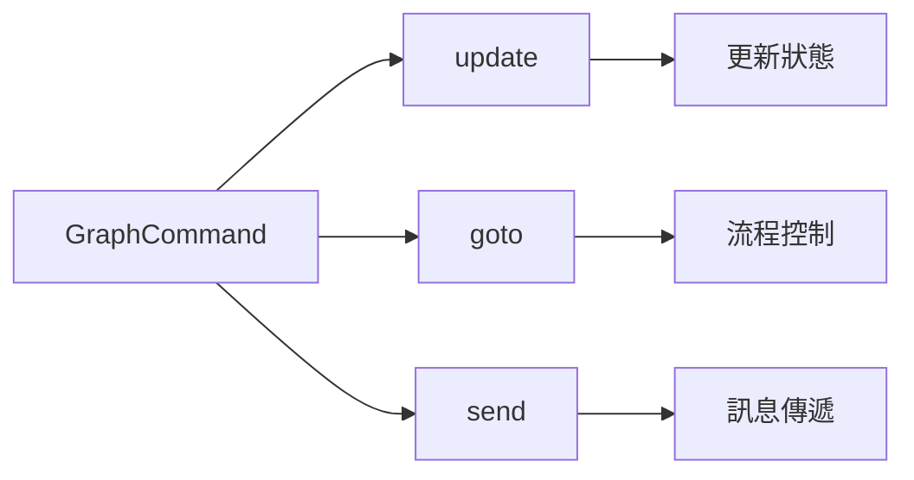
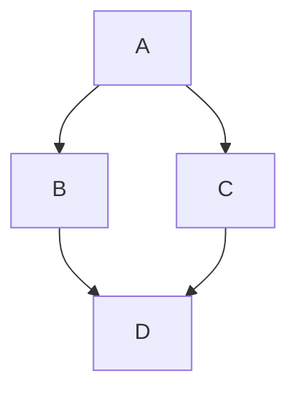
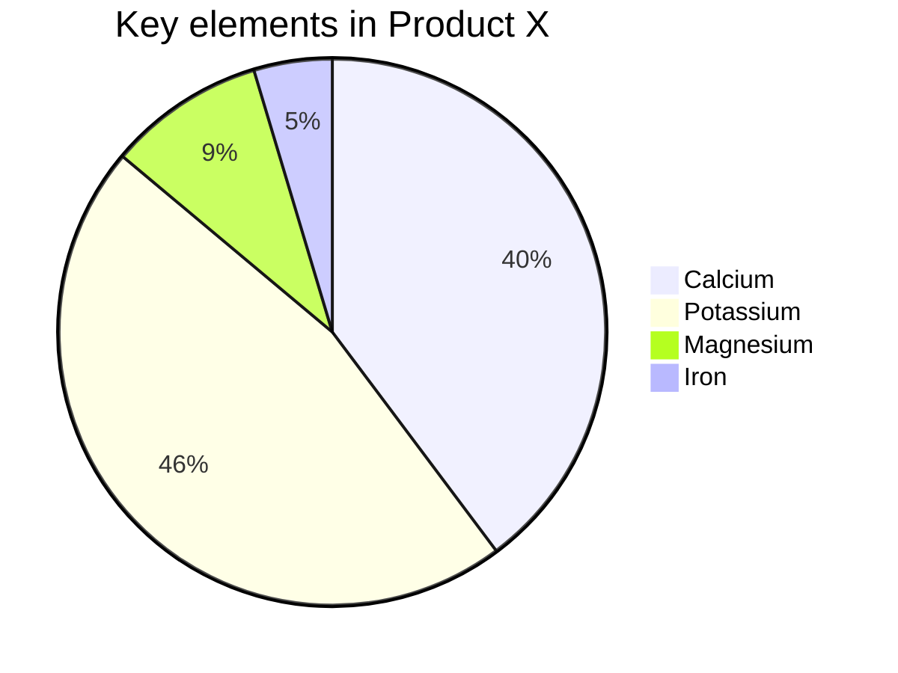
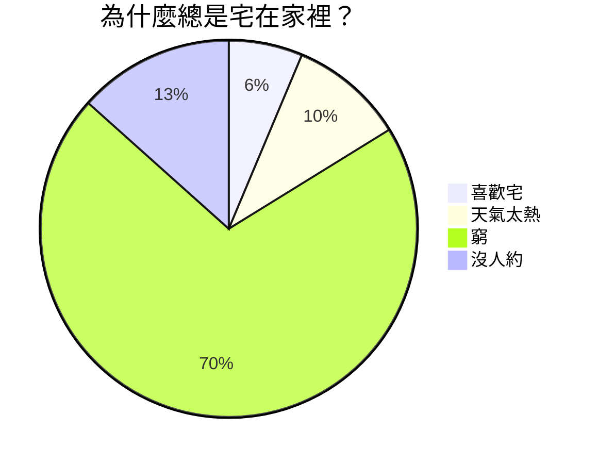
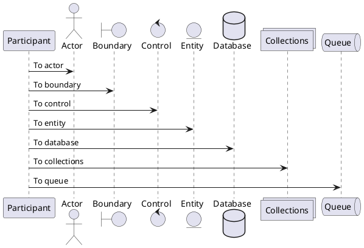

# 探索 Markdown 的奇妙世界

歡迎來到 Markdown 的奇妙世界！無論你是寫作愛好者、開發者、部落客，還是想要簡單記錄點什麼的人，Markdown 都能成為你新的好夥伴。它不僅讓寫作變得簡單明瞭，還能輕鬆地將內容轉化為漂亮的網頁格式。今天，我們將全面探討 Markdown 的基礎和進階語法，讓你在這個過程中充分享受寫作的樂趣！

Markdown 是一種輕量級標記語言，用於格式化純文字。它以簡單、直觀的語法而著稱，可以快速地產生 HTML。Markdown 是寫作與程式碼的完美結合，既簡單又強大。

## Markdown 基礎語法

### 1. 標題：讓你的內容層次分明

用 `#` 號來建立標題。標題從 `#` 開始，`#` 的數量表示標題的級別。

```markdown
# 一級標題

## 二級標題

### 三級標題

#### 四級標題
```

以上程式碼將渲染出一組層次分明的標題，使你的內容井井有條。

### 2. 段落與換行：自然流暢

Markdown 中的段落就是一行接一行的文字。要建立新段落，只需在兩行文字之間空一行。

### 3. 字體樣式：強調你的文字

- **粗體**：用兩個星號或底線包裹文字，如 `**粗體**` 或 `__粗體__`。
- _斜體_：用一個星號或底線包裹文字，如 `*斜體*` 或 `_斜體_`。
- ~~刪除線~~：用兩個波浪線包裹文字，如 `~~刪除線~~`。
- ==醒目提示==：用兩個等號包裹文字，如 `==醒目提示==`。
- ++底線++：用兩個加號包裹文字，如 `++底線++`。
- ~波浪線~：用一個波浪線包裹文字，如 `~波浪線~`。

這些簡單的標記可以讓你的內容更有層次感和重點突出。

### 4. 列表：整潔有序

- **無序列表**：用 `-`、`*` 或 `+` 加空格開始一行。
- **有序列表**：使用數字加點號（`1.`、`2.`）開始一行。

在列表中巢狀其他內容？只需縮排即可實現巢狀效果。

- 無序列表項 1
  1. 巢狀有序列表項 1
  2. 巢狀有序列表項 2
- 無序列表項 2

1. 有序列表項 1
2. 有序列表項 2

### 5. 連結與圖片：豐富內容

- **連結**：用方括號和圓括號建立連結 `[顯示文字](連結位址)`。
- **圖片**：和連結類似，只需在前面加上 `!`，如 ``。

[造訪 Doocs](https://github.com/doocs)


輕鬆實現富媒體內容展示！

> 因微信公眾號平台不支援除公眾號內容以外的連結，故其他平台的連結，會呈現連結樣式但無法點擊跳轉。

> 對於這些連結請注意明文繕寫，或點擊左上角「格式->微信外連結轉底部引用」開啟引用，這樣就可以在底部觀察到連結指向。

另外，使用 `<,>` 語法可以建立橫屏滑動投影片，支援微信公眾號平台。建議使用相似尺寸的圖片以獲得最佳顯示效果。

### 6. 引用：引用名言或引人深思的句子

使用 `>` 來建立引用，只需在文字前面加上它。多層引用？在前一層 `>` 後再加一個就行。

> 這是一個引用
>
> > 這是一個巢狀引用

這讓你的引用更加富有層次感。

### 7. 程式碼區塊：展示你的程式碼

- **行內程式碼**：用反引號包裹，如 `code`。
- **程式碼區塊**：用三個反引號包裹，並指定語言，如：

```js
console.log(`Hello, Doocs!`)
```

語法醒目提示讓你的程式碼更易讀。

### 8. 分隔線：分割內容

用三個或更多的 `-`、`*` 或 `_` 來建立分隔線。

---

為你的內容添加視覺分隔。

### 9. 表格：清晰展示資料

Markdown 支援簡單的表格，用 `|` 和 `-` 分隔儲存格和表頭。

| 專案人員                                    | 信箱                   | 微信號       |
| ------------------------------------------- | ---------------------- | ------------ |
| [yanglbme](https://github.com/yanglbme)     | contact@yanglibin.info | YLB0109      |
| [YangFong](https://github.com/YangFong)     | yangfong2022@gmail.com | yq2419731931 |

這樣的表格讓資料展示更為清爽！

> 手動編寫標記太麻煩？我們提供了便捷方式。左上方點擊「編輯->插入表格」，即可快速實現表格渲染。

### 10. 目錄：自動產生文件導覽

在文件中單獨一行寫入 `[TOC]`，即可根據文件標題自動產生層級目錄，方便讀者快速跳轉。

```markdown
[TOC]
```

> 一級標題（`#`）不會出現在目錄中，目錄錨點根據標題在文件中的位置自動產生。

## Markdown 進階技巧

### 1. LaTeX 公式：完美展示數學運算式

Markdown 允許嵌入 LaTeX 語法展示數學公式：

- **行內公式**：用 `$` 包裹公式，如 $E = mc^2$。
- **塊級公式**：用 `$$` 包裹公式，如：

$$
\begin{aligned}
d_{i, j} &\leftarrow d_{i, j} + 1 \\
d_{i, y + 1} &\leftarrow d_{i, y + 1} - 1 \\
d_{x + 1, j} &\leftarrow d_{x + 1, j} - 1 \\
d_{x + 1, y + 1} &\leftarrow d_{x + 1, y + 1} + 1
\end{aligned}
$$

現在還支援 **LaTeX 標準格式**：

- **行內公式**：用 `\(...\)` 包裹公式，如 \(x^2 + y^2 = z^2\)。
- **塊級公式**：用 `\[...\]` 包裹公式，如：

\[
\int\_{-\infty}^{\infty} e^{-x^2} dx = \sqrt{\pi}
\]

混合使用示例：傳統格式 $a + b = c$ 和 LaTeX 格式 \(d + e = f\) 可以在同一段落中共存。

1. 列表內塊公式 1

$$
\chi^2 = \sum \frac{(O - E)^2}{E}
$$

2. 列表內塊公式 2

$$
\chi^2 = \sum \frac{(|O - E| - 0.5)^2}{E}
$$

這是展示複雜數學表達的利器！

> [!TIP]
> 預覽區域的 LaTeX 公式支援點擊編輯，點擊後彈出公式編輯器，內建常用公式庫，可快速完成公式修改。

### 2. Mermaid 流程圖：視覺化流程

Mermaid 是強大的視覺化工具，可以在 Markdown 中建立流程圖、時序圖等。









這種方式不僅能直觀展示流程，還能提升文件的專業性。

> 更多用法，參見：[Mermaid User Guide](https://mermaid.js.org/intro/getting-started.html)。

### 3. PlantUML 流程圖：視覺化流程

PlantUML 是強大的視覺化工具，可以在 Markdown 中建立流程圖、時序圖等。



> 更多用法，參見：[PlantUML 主頁](https://plantuml.com/zh/)。

### 4. Infographic 資訊圖：視覺化資料

新一代資訊圖視覺化引擎，讓文字資訊栩栩如生！

```infographic
infographic list-row-horizontal-icon-arrow
data
  title 客戶增長引擎
  desc 多通路觸達與回購提升
  items
    - label 線索獲取
      value 18.6
      desc 通路投放與內容獲客
      icon rocket-launch
    - label 轉化提效
      value 12.4
      desc 線索評分與自動跟進
      icon progress-check
    - label 回購提升
      value 9.8
      desc 會員體系與權益運營
      icon account-sync
    - label 口碑傳播
      value 6.2
      desc 社群激勵與推薦裂變
      icon account-group
```

> 更多用法，參見：[AntV Infographic Gallery](https://infographic.antv.vision/gallery)。

### 5. Ruby 注音：注音標註

支援兩種格式：

```md
1. [文字]{注音}
2. [文字]^(注音)
```

渲染效果如下：

[你好]{nǐ hǎo} [世界]{shì jiè}

支援四種分隔符： `・`（中點）、`．` (全形句點)、`。` (中文句號)、`-` (英文減號)

示例：

```md
[你好世界]{nǐ・hǎo・shì・jiè}
[小夜時雨]^(さ・よ・しぐれ)
```

[你好世界]{nǐ・hǎo・shì・jiè}
[小夜時雨]^(さ・よ・しぐれ)

當字串數量與分隔符數量不相符時，會自動匹配到最適合的分隔符。

```md
[小夜時雨]{さ・よ・しぐれ}
[小夜時雨]{さ・よ}
[小夜]{さ・よ・しぐれ}
[小夜時雨]{さ・よ・しぐれ・extra}
```

[小夜時雨]{さ・よ・しぐれ}
[小夜時雨]{さ・よ}
[小夜]{さ・よ・しぐれ}
[小夜時雨]{さ・よ・しぐれ・extra}

### 6. 警告區塊與環境：突出重點內容

使用 `> [!類型]` 或 `::: 類型 ... :::` 語法即可建立帶樣式的警告區塊。類型後還能跟一個**自訂標題**，正文支援完整的 Markdown 與公式。

常用的提示類型：

> [!NOTE]
> 提醒讀者即使在快速瀏覽時也應留意的資訊。

> [!TIP]
> 幫助讀者更順利完成操作的小技巧。

> [!IMPORTANT] 上線前必讀
> 類型後可以跟自訂標題，覆蓋預設標題。

> [!WARNING]
> 需要立即引起注意的關鍵內容。

也可以使用 `:::` 容器語法，效果相同：

::: tip
這是一個使用容器語法的提示框。
:::

還內建了定理、引理、定義等**學術環境**，正文可直接書寫公式：

::: theorem 勾股定理
在直角三角形中，斜邊的平方等於兩條直角邊的平方和：$a^2 + b^2 = c^2$。
:::

::: definition
若對任意 $\varepsilon > 0$，存在 $\delta > 0$，使得 $0 < |x - a| < \delta$ 時有 $|f(x) - L| < \varepsilon$，則稱 $\lim_{x \to a} f(x) = L$。
:::

::: proof
由上述定義直接可得，證畢。
:::

類型名稱可以是**任意文字**（包括中文），未匹配到內建樣式時會使用統一的預設樣式，並以名稱作為標題：

::: 推論
任意名稱都會渲染成一個帶標題的方框。
:::

## 結語

Markdown 是一種簡單、強大且易於掌握的標記語言，透過學習基礎和進階語法，你可以快速創作內容並有效傳達資訊。無論是技術文件、個人部落格還是專案說明，Markdown 都是你的得力助手。希望這篇內容能夠帶你全面了解 Markdown 的潛力，讓你的寫作更加豐富多彩！

現在，拿起 Markdown 編輯器，開始創作吧！探索 Markdown 的世界，你會發現它遠比想像中更精彩！

### 推薦閱讀

- [阿里又一個 20k+ stars 開源專案誕生，恭喜 fastjson！](https://mp.weixin.qq.com/s/RNKDCK2KoyeuMeEs6GUrow)
- [刷掉 90% 候選人的互聯網大廠海量資料面試題（附題解 + 方法總結）](https://mp.weixin.qq.com/s/rjGqxUvrEqJNlo09GrT1Dw)
- [好用！期待已久的文字區塊功能究竟如何在 Java 13 中發揮作用？](https://mp.weixin.qq.com/s/kalGv5T8AZGxTnLHr2wDsA)
- [2019 GitHub 開源貢獻排行榜新鮮出爐！微軟谷歌領頭，阿里躋身前 12！](https://mp.weixin.qq.com/s/_q812aGD1b9QvZ2WFI0Qgw)

---

<center>
    
</center>
