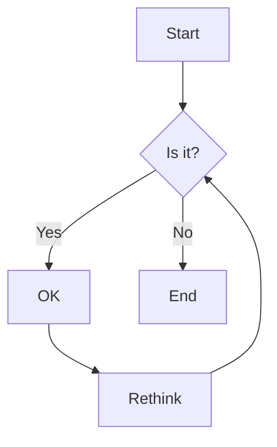
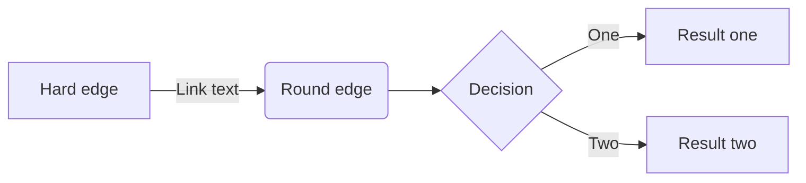
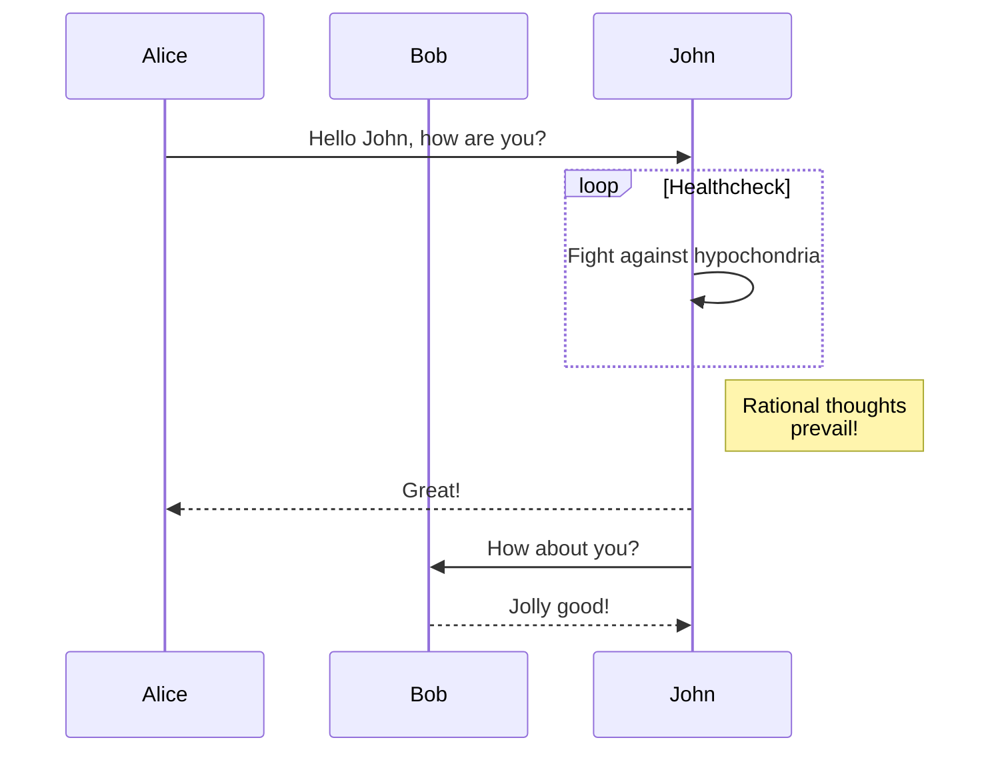
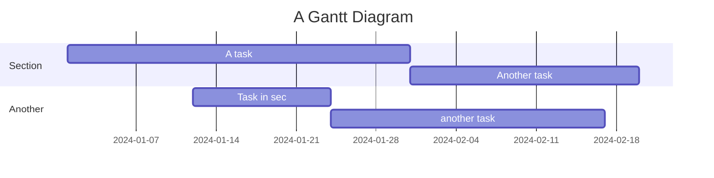
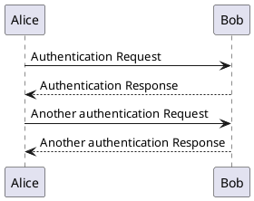

# 📝 Markdown Syntax Guide

A complete reference for all Markdown syntax supported by doocs/md, including standard Markdown, GitHub Flavored Markdown (GFM), and special extensions.

---

## 📋 Table of Contents

- [Basic Syntax](#basic-syntax)
- [Extended Syntax](#extended-syntax)
- [GFM Features](#gfm-features)
- [Math Formulas](#math-formulas)
- [Diagrams](#diagrams)
- [Ruby Annotations](#ruby-annotations)
- [Special Formatting for WeChat](#special-formatting-for-wechat)

---

## Basic Syntax

### Headers

```markdown
# H1 Heading
## H2 Heading
### H3 Heading
#### H4 Heading
##### H5 Heading
###### H6 Heading
```

### Text Formatting

```markdown
**Bold text**
*Italic text*
***Bold and italic***
~~Strikethrough~~
`Inline code`
```

**Renders as:**

**Bold text**  
*Italic text*  
***Bold and italic***  
~~Strikethrough~~  
`Inline code`

### Lists

#### Unordered Lists

```markdown
- Item 1
- Item 2
  - Nested item 2.1
  - Nested item 2.2
- Item 3
```

**Renders as:**

- Item 1
- Item 2
  - Nested item 2.1
  - Nested item 2.2
- Item 3

#### Ordered Lists

```markdown
1. First item
2. Second item
   1. Nested item 2.1
   2. Nested item 2.2
3. Third item
```

**Renders as:**

1. First item
2. Second item
   1. Nested item 2.1
   2. Nested item 2.2
3. Third item

#### Task Lists

```markdown
- [x] Completed task
- [ ] Incomplete task
- [ ] Another incomplete task
```

**Renders as:**

- [x] Completed task
- [ ] Incomplete task
- [ ] Another incomplete task

### Links and Images

```markdown
[Link text](https://example.com)
[Link with title](https://example.com "Title")


```

### Blockquotes

```markdown
> This is a blockquote.
> It can span multiple lines.
>
> > Nested blockquote
```

**Renders as:**

> This is a blockquote.
> It can span multiple lines.
>
> > Nested blockquote

### Code Blocks

#### Inline Code

```markdown
Use `console.log()` for debugging.
```

#### Fenced Code Blocks

~~~markdown
```javascript
function hello() {
  console.log("Hello, World!");
}
```

```python
def hello():
    print("Hello, World!")
```
~~~

**Supported languages:** 100+ languages including JavaScript, Python, Java, Go, Rust, TypeScript, CSS, HTML, SQL, Bash, and more.

### Tables

```markdown
| Header 1 | Header 2 | Header 3 |
|----------|----------|----------|
| Cell 1   | Cell 2   | Cell 3   |
| Cell 4   | Cell 5   | Cell 6   |
| Left     | Center   | Right    |
|:---------|:--------:|---------:|
```

**Renders as:**

| Header 1 | Header 2 | Header 3 |
|----------|----------|----------|
| Cell 1   | Cell 2   | Cell 3   |
| Cell 4   | Cell 5   | Cell 6   |

### Horizontal Rule

```markdown
---
***
___
```

**Renders as:**

---

---

## Extended Syntax

### Footnotes

```markdown
Here's a sentence with a footnote[^1].

[^1]: This is the footnote content.
```

### Definition Lists

```markdown
Term 1
: Definition 1

Term 2
: Definition 2a
: Definition 2b
```

### Emoji Shortcodes

```markdown
:smile: :heart: :thumbsup: :rocket:
```

**Renders as:** 😄 ❤️ 👍 🚀

---

## GFM Features

### Alerts (Callouts)

```markdown
> [!NOTE]
> Useful information that users should know.

> [!TIP]
> Helpful advice for doing things better or more easily.

> [!IMPORTANT]
> Key information users need to know to achieve their goal.

> [!WARNING]
> Urgent info that needs immediate attention.

> [!CAUTION]
> Advises about risks or negative outcomes.
```

**Renders as:**

> [!NOTE]
> Useful information that users should know.

> [!TIP]
> Helpful advice for doing things better or more easily.

> [!IMPORTANT]
> Key information users need to know to achieve their goal.

> [!WARNING]
> Urgent info that needs immediate attention.

> [!CAUTION]
> Advises about risks or negative outcomes.

### Auto-links

```markdown
Visit https://github.com/doocs/md for more information.
Email us at contact@example.com
```

### Mentioning Users

```markdown
@username mentioned this feature in #123
```

---

## Math Formulas

Using LaTeX syntax with KaTeX rendering:

### Inline Math

```markdown
The quadratic formula is $x = {-b \pm \sqrt{b^2-4ac} \over 2a}$.
```

**Renders as:**

The quadratic formula is $x = {-b \pm \sqrt{b^2-4ac} \over 2a}$.

### Block Math

```markdown
$$
E = mc^2
$$

$$
\begin{aligned}
\nabla \times \vec{\mathbf{B}} -\, \frac1c\, \frac{\partial\vec{\mathbf{E}}}{\partial t} & = \frac{4\pi}{c}\vec{\mathbf{j}} \\
\nabla \cdot \vec{\mathbf{E}} & = 4 \pi \rho \\
\nabla \times \vec{\mathbf{E}}\, +\, \frac1c\, \frac{\partial\vec{\mathbf{B}}}{\partial t} & = \vec{\mathbf{0}} \\
\nabla \cdot \vec{\mathbf{B}} & = 0
\end{aligned}
$$
```

**Renders as:**

$$
E = mc^2
$$

### Common Symbols

| Syntax | Rendered |
|--------|----------|
| `\alpha, \beta, \gamma` | α, β, γ |
| `\times, \div, \pm` | ×, ÷, ± |
| `\sum, \prod, \int` | ∑, ∏, ∫ |
| `\rightarrow, \Rightarrow` | →, ⇒ |
| `\infty, \partial, \nabla` | ∞, ∂, ∇ |
| `\frac{a}{b}` | a/b (fraction) |
| `\sqrt{x}` | √x |
| `x^{n}, x_{n}` | xⁿ, xₙ |

---

## Diagrams

### Mermaid Diagrams

~~~markdown

~~~

**Renders as:**


### Mermaid Flowchart

~~~markdown

~~~

### Mermaid Sequence Diagram

~~~markdown

~~~

### Mermaid Gantt Chart

~~~markdown

~~~

### PlantUML

~~~markdown

~~~

---

## Ruby Annotations

Perfect for Chinese phonetics, Japanese furigana, or educational content:

### Basic Syntax

```markdown
[汉字]{hàn zì}
[漢字]{かんじ}
```

**Renders as:**

[汉字]{hàn zì}  
[漢字]{かんじ}

### Alternative Syntax

```markdown
[文字]^(zhù yīn)
[文字]^ (zhù yīn)
```

### Multiple Characters

```markdown
[中华人民共和国]{Zhōnghuá Rénmín Gònghéguó}
```

---

## Special Formatting for WeChat

### Color Adaptation

doocs/md automatically converts colors to WeChat-compatible formats:

```markdown
<span style="color: #ff0000;">Red text</span>
<span style="color: rgb(0, 128, 0);">Green text</span>
```

### Code Block Styling

Mac-style code blocks with automatic syntax highlighting:

~~~markdown
```javascript
// Your code here
function example() {
  return "Hello WeChat!";
}
```
~~~

### Image Optimization

Images are automatically optimized for WeChat:
- Automatic compression
- Format conversion (WebP → JPEG for compatibility)
- Size limits enforcement

### Custom CSS

You can add custom CSS in the editor:

```css
/* Custom styles for your article */
h1 {
  color: #2c3e50;
  border-bottom: 2px solid #3498db;
}

blockquote {
  border-left: 4px solid #3498db;
  background: #f8f9fa;
}
```

---

## 📚 Quick Reference Card

### Most Common Elements

| Element | Markdown Syntax |
|---------|----------------|
| Heading | `# H1` `## H2` `### H3` |
| Bold | `**bold**` |
| Italic | `*italic*` |
| Link | `[text](url)` |
| Image | `` |
| Code | `` `code` `` |
| Code block | ```` ```language ```` |
| List | `- item` or `1. item` |
| Quote | `> quote` |
| Horizontal rule | `---` |
| Line break | `two spaces` or `<br>` |

### Keyboard Shortcuts

| Action | Shortcut |
|--------|----------|
| Bold | `Ctrl/Cmd + B` |
| Italic | `Ctrl/Cmd + I` |
| Save | `Ctrl/Cmd + S` |
| Preview | `Ctrl/Cmd + P` |

---

**Need more examples?** Check out our [Example Content](./example-content.md) for complete article templates!

*Last updated: April 2026*
