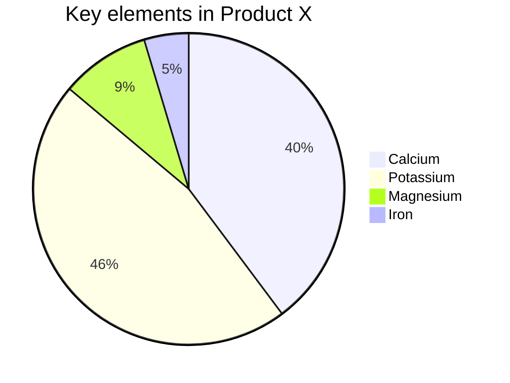
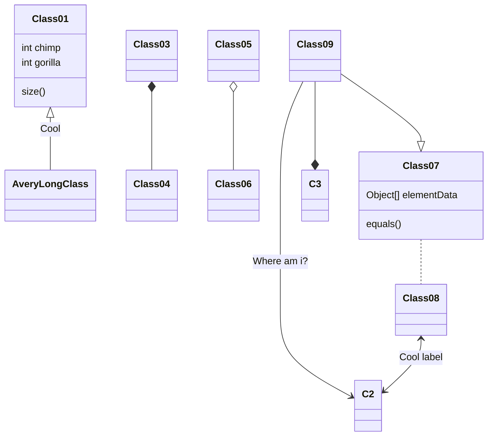

# 微信 Markdown 编辑器 @doocs/md

## 项目介绍

Markdown 文档自动即时渲染为微信图文，让你不再为微信文章排版而发愁！只要你会基本的 Markdown 语法，就能做出一篇样式简洁而又美观大方的微信图文。


## 功能特性

- [x] 支持自定义 CSS 样式
- [x] 支持 Markdown 所有基础语法、数学公式、Mermaid 图表
- [x] 支持浅色、深色两种编辑器外观
- [x] 支持 <kbd>Alt</kbd> + <kbd>Shift</kbd> + <kbd>F</kbd> 快速格式化文档
- [x] 支持色盘取色，快速替换文章整体色调
- [x] 支持多图上传，可自定义配置图床
- [x] 支持自定义上传逻辑
- [x] 支持在编辑框右键弹出功能选项卡
- [x] 支持批量转换本地图片为线上图片


## 如何开发和部署

```sh
# 安装依赖
npm i

# 启动开发模式
npm start

# 部署在 /md 目录
npm run build
# 访问 http://127.0.0.1:9000/md

# 部署在根目录
npm run build:h5-netlify
# 访问 http://127.0.0.1:9000/
```

## 快速搭建私有服务

### 方式 1. 使用 npm cli

通过我们的 npm cli 你可以轻易搭建属于自己的微信 Markdown 编辑器。

```sh
# 安装
npm i -g @doocs/md-cli

# 启动
md-cli

# 访问
open http://127.0.0.1:8800/md/

# 启动并指定端口
md-cli port=8899

# 访问
open http://127.0.0.1:8899/md/
```

md-cli 支持以下命令行参数：

- `port` 指定端口号，默认 8800，如果被占用会随机使用一个新端口。
- `spaceId` dcloud 服务空间配置
- `clientSecret` dcloud 服务空间配置

### 方式 2. 使用 Docker 镜像

如果你是 Docker 用户，也可以直接使用一条命令，启动完全属于你的、私有化运行的实例。

```sh
docker run -d -p 8080:80 doocs/md:latest
```

容器运行起来之后，打开浏览器，访问 http://localhost:8080 即可。

关于本项目 Docker 镜像的更多详细信息，可以关注 https://github.com/doocs/docker-md

#### 推荐阅读

- [阿里又一个 20k+ stars 开源项目诞生，恭喜 fastjson！](https://mp.weixin.qq.com/s/RNKDCK2KoyeuMeEs6GUrow)
- [刷掉 90% 候选人的互联网大厂海量数据面试题（附题解 + 方法总结）](https://mp.weixin.qq.com/s/rjGqxUvrEqJNlo09GrT1Dw)
- [好用！期待已久的文本块功能究竟如何在 Java 13 中发挥作用？](https://mp.weixin.qq.com/s/kalGv5T8AZGxTnLHr2wDsA)
- [2019 GitHub 开源贡献排行榜新鲜出炉！微软谷歌领头，阿里跻身前 12！](https://mp.weixin.qq.com/s/_q812aGD1b9QvZ2WFI0Qgw)

---

欢迎关注我的公众号“**Doocs**”，原创技术文章第一时间推送。

<center>
    
</center>


----

# Markdown 语法教程

Markdown 是一种轻量级标记语言，常用于撰写格式简单的文本文件，如文档、博客、和 README 文件。它通过简单的语法将普通文本转换为格式化的 HTML 文档。下面是 Markdown 的基本语法介绍。

## 标题

Markdown 使用 `#` 来表示标题。标题等级从 1 到 4，对应 HTML 的 `<h1>` 到 `<h4>` 标签。

```markdown
# 一级标题
## 二级标题
### 三级标题
#### 四级标题
```

效果：

# 一级标题
## 二级标题
### 三级标题
#### 四级标题

## 段落和换行

普通文本直接书写即可形成段落。段落之间空一行即可。使用两个或多个空格加回车来实现换行。

```markdown
这是第一段文字。

这是第二段文字。  
这是同一段中的换行。
```

效果：

这是第一段文字。

这是第二段文字。  
这是同一段中的换行。

## 字体样式

- **加粗**：使用 `**` 或 `__` 包裹文本。
- *斜体*：使用 `*` 或 `_` 包裹文本。
- ~~删除线~~：使用 `~~` 包裹文本。

```markdown
**加粗**
*斜体*
~~删除线~~
```

效果：

**加粗**  
*斜体*  
~~删除线~~

## 列表

### 无序列表

使用 `-`、`+` 或 `*` 加空格来创建无序列表。

```markdown
- 项目一
- 项目二
  - 子项目
- 项目三
```

效果：

- 项目一
- 项目二
  - 子项目
- 项目三

### 有序列表

使用数字加点来创建有序列表。

```markdown
1. 项目一
2. 项目二
   1. 子项目
3. 项目三
```

效果：

1. 项目一
2. 项目二
   1. 子项目
3. 项目三

## 链接

### 行内链接

使用 `[显示文本](链接地址)` 创建行内链接。

```markdown
[百度](https://www.baidu.com)
```

效果：

[百度](https://www.baidu.com)

## 图片

使用 `` 插入图片。

```markdown

```

效果：


## 代码

### 行内代码

使用反引号 `` ` `` 包裹行内代码。

```markdown
使用 `print('Hello World')` 来输出文本。
```

效果：

使用 `print('Hello World')` 来输出文本。

### 代码块

使用三个反引号 ``` 包裹代码块，可以指定语言来高亮代码。

```markdown
```python
def hello():
    print("Hello, World!")
```
```

效果：

```python
def hello():
    print("Hello, World!")
```

## 流程图







## 表格

使用 `|` 分隔列，使用 `-` 分隔表头和内容。

```markdown
| 名称   | 年龄 | 城市   |
|--------|------|--------|
| 小明   | 20   | 北京   |
| 小红   | 22   | 上海   |
```

效果：

| 名称   | 年龄 | 城市   |
|--------|------|--------|
| 小明   | 20   | 北京   |
| 小红   | 22   | 上海   |

## 引用

使用 `>` 创建引用。

```markdown
> 这是一段引用文本。
```

效果：

> 这是一段引用文本。

## 分割线

使用三个或更多的 `-`、`*`、`_` 创建分割线。

```markdown
---
```

效果：

---

### 结束语

Markdown 简洁易学，适合用于各种简单的文本格式需求。如果想要深入了解更多语法，推荐查阅 [Markdown 官方文档](https://daringfireball.net/projects/markdown/)。
